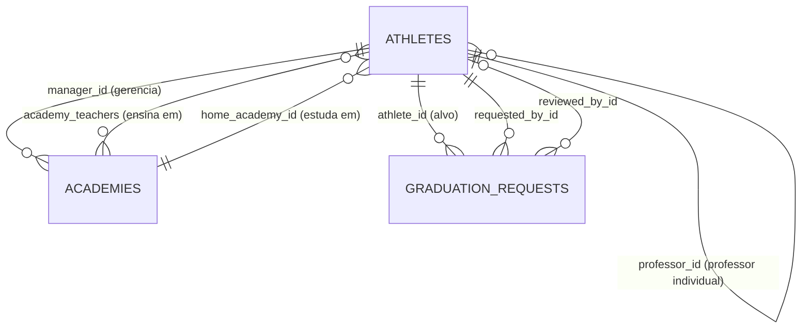

# Arquitetura — Modelo de Dados

Fonte: `backend/app/models/`. Migrations em `backend/alembic/versions/`
(`0001_initial`, `0002_avatar_url`).

## Diagrama ER

## athletes

Modelo único para **todos** os usuários do sistema — o papel é o campo `role`
(ver [ADR-002](../decisions/ADR-002-modelo-unico-athlete-com-roles.md)).

| Coluna | Tipo | Restrições |
|---|---|---|
| `id` | int PK | |
| `name` | varchar(255) | NOT NULL |
| `email` | varchar(255) | UNIQUE, nullable, indexado (`ix_athletes_email`) |
| `cpf` | varchar(14) | UNIQUE, nullable, indexado — armazenado **só dígitos** (11) |
| `phone` | varchar(32) | nullable |
| `birth_date` | date | nullable — idade é **calculada**, nunca armazenada |
| `weight_kg` | float | nullable (validação: 0 < x < 500) |
| `sex` | enum `athlete_sex` (`male`/`female`) | nullable |
| `graduation` | varchar(32) | NOT NULL — string canônica (ver abaixo) |
| `role` | enum `athlete_role` | NOT NULL, default `athlete` |
| `password_digest` | varchar(255) | nullable — bcrypt; sem digest ⇒ não consegue logar |
| `active` | boolean | NOT NULL, default true — conta inativa não autentica |
| `avatar_url` | varchar(500) | nullable — path interno `/uploads/avatars/*.webp` ou URL externa |
| `home_academy_id` | FK → academies | nullable, **ON DELETE SET NULL** |
| `professor_id` | FK → athletes (auto-relação) | nullable, **ON DELETE SET NULL** |
| `created_at` / `updated_at` | timestamptz | server default `now()` |

Roles: `athlete` (aluno), `teacher` (professor, exige ≥ 1º Dan), `academy_manager`
(gestor, exige ≥ 1º Dan), `admin` (federação).

Propriedades derivadas (calculadas no model, expostas pelo schema `AthleteRead`):
`age`, `is_dan_rank`, `can_be_professor`, `home_academy_name`, `professor_name`,
`teaching_at_academy_ids`.

Hierarquia semântica dos helpers de permissão (importante — não é só igualdade de role):

- `is_teacher` ⇒ role ∈ {teacher, academy_manager, admin}
- `is_academy_manager` ⇒ role ∈ {academy_manager, admin}
- `is_admin` ⇒ role = admin

## academies

| Coluna | Tipo | Restrições |
|---|---|---|
| `id` | int PK | |
| `name` | varchar(255) | NOT NULL |
| `cnpj` | varchar(18) | UNIQUE, nullable |
| `address` / `city` / `state` / `zip_code` | varchar | nullable (`state` = UF, 2 chars) |
| `latitude` / `longitude` | float | nullable — usadas no mapa público |
| `phone` / `email` | varchar | nullable |
| `active` | boolean | NOT NULL, default true |
| `manager_id` | FK → athletes | **NOT NULL**, **ON DELETE RESTRICT** |
| `created_at` / `updated_at` | timestamptz | |

Derivados: `manager_name`, `manager_contact` (phone ou email), `students_count`,
`teachers_count`, `teacher_ids`.

## academy_teachers (associação N:N)

Professor pode ensinar em várias academias. Tabela pura de associação:
`academy_id` + `athlete_id`.

## graduation_requests

Fluxo de aprovação de mudança de graduação
(ver [ADR-003](../decisions/ADR-003-graduacao-somente-via-fluxo-aprovacao.md)).

| Coluna | Tipo | Restrições |
|---|---|---|
| `id` | int PK | |
| `athlete_id` | FK → athletes | NOT NULL, **ON DELETE CASCADE** |
| `from_graduation` | varchar(32) | NOT NULL — snapshot da graduação no momento do pedido |
| `to_graduation` | varchar(32) | NOT NULL |
| `requested_by_id` | FK → athletes | NOT NULL, **ON DELETE RESTRICT** |
| `reviewed_by_id` | FK → athletes | nullable, **ON DELETE SET NULL** |
| `status` | enum `graduation_request_status` | NOT NULL, default `pending` |
| `reason` | text | nullable — justificativa do solicitante |
| `review_notes` | text | nullable — observações do admin |
| `created_at` | timestamptz | server default `now()` |
| `reviewed_at` | timestamptz | nullable |

Transições de status: `pending → approved` ou `pending → rejected`. Estados finais são
imutáveis (tentativa de re-revisão retorna 409). A unicidade de "uma request pendente por
atleta" é imposta **na aplicação**, não por constraint de banco.

## Semântica de deleção (resumo)

| Ao deletar... | Efeito |
|---|---|
| Atleta que é professor de outros | **Bloqueado** (409, regra de aplicação) |
| Atleta que gerencia academia | **Bloqueado** (409 na aplicação; RESTRICT no banco) |
| Atleta comum | Requests dele são apagadas (CASCADE); alunos que o tinham como professor ficam com `professor_id = NULL` |
| Academia com alunos | **Bloqueado** (409, regra de aplicação) |
| Academia sem alunos | Atletas que a tinham como `home_academy` ficam NULL; vínculos N:N somem |

## Graduações — domínio canônico

20 níveis, do iniciante ao mestre, armazenados como **string exata**
(ver [ADR-007](../decisions/ADR-007-graduacoes-strings-canonicas.md)):

`10º Gub` → `1º Gub` (coloridas), depois `1º Dan` → `10º Dan` (pretas).

- Fonte backend: `backend/app/core/graduations.py` (validação Pydantic rejeita valor fora da lista).
- Espelho frontend: `frontend/lib/graduations.ts` (mesmas strings + labels com cor da faixa).
- `can_be_professor(g)` ⇒ regex `^([1-9]|10)º Dan$` — regra "≥ 1º Dan" para teacher/manager.

**Ao alterar a lista, os dois arquivos mudam no mesmo commit.**

## Seed (`backend/scripts/seed.py`)

Popula dados de demonstração: 1 admin, 2 gestores com academias (Tigre/Brasília e
Dragão/Goiânia, com coordenadas GPS), 1 professor, alunos de exemplo e solicitações de
graduação em vários status. **Apaga todos os dados antes de inserir** — nunca rodar em
produção com dados reais. Credenciais geradas: ver [README](../../README.md#credenciais-de-teste-criadas-pelo-seed).
