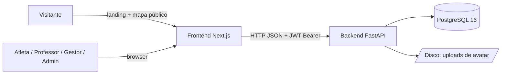

# Arquitetura — Visão Geral

## Contexto

A FECOT Platform gerencia atletas, academias e graduações da Federação Centro-Oeste de
Taekwondo. Usuários: administradores da federação, gestores de academia, professores e
atletas. Visitantes anônimos acessam a landing page (com mapa público de academias).



## Containers

| Container | Tecnologia | Porta | Responsabilidade |
|---|---|---|---|
| Frontend | Next.js 16 (App Router) + React 19 + TypeScript + Tailwind + shadcn/ui | 3000 | UI, navegação por role, cliente HTTP tipado |
| Backend | Python 3.12 + FastAPI + SQLAlchemy 2 + Alembic | 3002 | API REST, autenticação, autorização, regras de negócio |
| Banco | PostgreSQL 16 | 5432 | Persistência |
| Uploads | Disco local (`UPLOAD_DIR`) | — | Avatares processados (WebP) |

A porta 3002 do backend é herdada do `start.sh` da plataforma Rails original
(ver [ADR-001](../decisions/ADR-001-reescrita-fastapi-nextjs.md)).

## Backend — camadas

```
backend/app/
├── api/          # Rotas HTTP + autorização por endpoint (deps.py: require_admin, etc.)
│   └── deps.py   # get_current_athlete (JWT → Athlete), require_* (guards por role)
├── schemas/      # Pydantic — validação de entrada e serialização de saída (from_model)
├── models/       # SQLAlchemy — entidades + regras de permissão (can_edit_athlete_basic...)
├── services/     # Lógica não-trivial isolada (avatar_storage: validação/processamento)
├── core/         # config (pydantic-settings), security (JWT/bcrypt), graduations (domínio)
└── db/           # Engine, SessionLocal, Base, get_db
```

Convenções em vigor:

- **Autorização em duas camadas**: guards de role nas dependências (`require_admin`,
  `require_manager_or_admin`, `require_teacher_or_above`) + regras contextuais nos métodos
  do modelo (`can_edit_athlete_basic`, `can_request_graduation_change`, `manages`).
- **Schemas de resposta com `from_model`**: campos derivados (idade, nomes de relacionamentos,
  contagens) são calculados na serialização, nunca duplicados no banco.
- **Regras de negócio comentadas no topo de cada módulo** (docstring do arquivo).
- Rotas agregadas sob o prefixo `/api` em `app/api/__init__.py`.

## Frontend — estrutura

```
frontend/
├── app/
│   ├── page.tsx              # Landing pública (hero, sobre, mapa, footer)
│   ├── login/                # Login por email ou CPF
│   ├── recuperar-senha/      # Orienta redefinição via professor/gestor/admin (sem fluxo de email)
│   ├── perfil/               # Auto-serviço do usuário logado (/api/me)
│   └── dashboard/            # Área administrativa (teacher+)
│       ├── atletas/          # lista, novo, [id]/editar
│       ├── academias/        # lista, novo, [id]/editar
│       └── graduacoes/       # lista, nova solicitação
├── components/               # Componentes de página + components/ui (shadcn)
├── hooks/use-auth.ts         # Sessão: localStorage + revalidação via /api/me
└── lib/
    ├── api.ts                # Cliente HTTP tipado — único ponto de acesso à API
    ├── graduations.ts        # Espelho da lista canônica de graduações do backend
    └── utils.ts
```

Convenções em vigor:

- **Todo acesso à API passa por `lib/api.ts`** — nenhum `fetch` solto em componentes.
- **Sessão client-side**: token JWT e usuário em `localStorage` (`fecot_token`,
  `fecot_user`); `useAuth` revalida com `GET /api/me` ao montar
  (ver [ADR-004](../decisions/ADR-004-jwt-stateless-localstorage.md)).
- **Navegação por role**: `athlete` → `/perfil` apenas; `teacher`/`academy_manager`/`admin`
  → `/dashboard`. Sem middleware de rota — a proteção real é do backend
  (ver [constitution § II](../constitution.md)).
- **Identidade visual**: paleta verde/amarela da bandeira via tokens em `app/globals.css`,
  logo local em `public/logo-fecot.png` e divisor de marca `.faixa-divider`
  (ver [ADR-008](../decisions/ADR-008-identidade-visual-verde-amarela.md)).

## Fluxo de uma requisição autenticada

1. Componente chama `api.<método>()` (`lib/api.ts`), que anexa `Authorization: Bearer <token>`.
2. FastAPI resolve `get_current_athlete`: decodifica o JWT (HS256), carrega o `Athlete` do
   banco e rejeita com 401 se token inválido/expirado ou conta inativa.
3. O guard de role do endpoint (`require_*`) rejeita com 403 se o papel não basta.
4. O handler aplica regras contextuais (ex.: "manager só edita a própria academia") e
   validações de domínio (409/422).
5. Resposta serializada pelo schema `*Read.from_model(...)`, com campos derivados.

## Ambientes

| | Desenvolvimento | Produção |
|---|---|---|
| Orquestração | `docker-compose.yml` (db + backend com reload + frontend dev) | systemd (`fecot-backend`, `fecot-frontend`) em VPS Hostinger |
| Proxy | — (acesso direto às portas) | nginx (reverse proxy + SSL Let's Encrypt + serve `/uploads` via alias) |
| Migrations | `alembic upgrade head` no start do container | `alembic upgrade head` manual no deploy |
| Swagger | `/docs` e `/redoc` habilitados | **Desabilitados** (`APP_ENV=production`) |
| Uploads | volume `fecot_uploads` | `/var/lib/fecot/uploads` (com backup diário) |

Guia operacional completo: [DEPLOY.md](../../DEPLOY.md).

## Configuração (variáveis de ambiente do backend)

Definidas em `backend/app/core/config.py` (pydantic-settings, lê `.env`):

| Variável | Default | Uso |
|---|---|---|
| `APP_ENV` | `development` | `production` desliga Swagger/ReDoc |
| `PORT` | `3002` | Porta da API |
| `DATABASE_URL` | postgres local | Conexão SQLAlchemy (`postgresql+psycopg2://...`) |
| `JWT_SECRET` | placeholder | **Obrigatório trocar em produção** |
| `JWT_ALGORITHM` | `HS256` | Algoritmo do token |
| `JWT_ACCESS_TOKEN_EXPIRE_MINUTES` | `1440` (24h) | Validade do token |
| `CORS_ORIGINS` | `http://localhost:3000` | Lista explícita separada por vírgula — nunca `*` |
| `UPLOAD_DIR` | `./uploads` | Pasta física dos avatares |
| `UPLOAD_PUBLIC_PREFIX` | `/uploads` | Prefixo público (nginx faz alias em produção) |
| `AVATAR_MAX_MB` | `5` | Limite de upload |
| `AVATAR_MAX_SIZE` | `512` | Lado máximo (px) após processamento |

Frontend: apenas `NEXT_PUBLIC_API_URL` (URL base da API).
