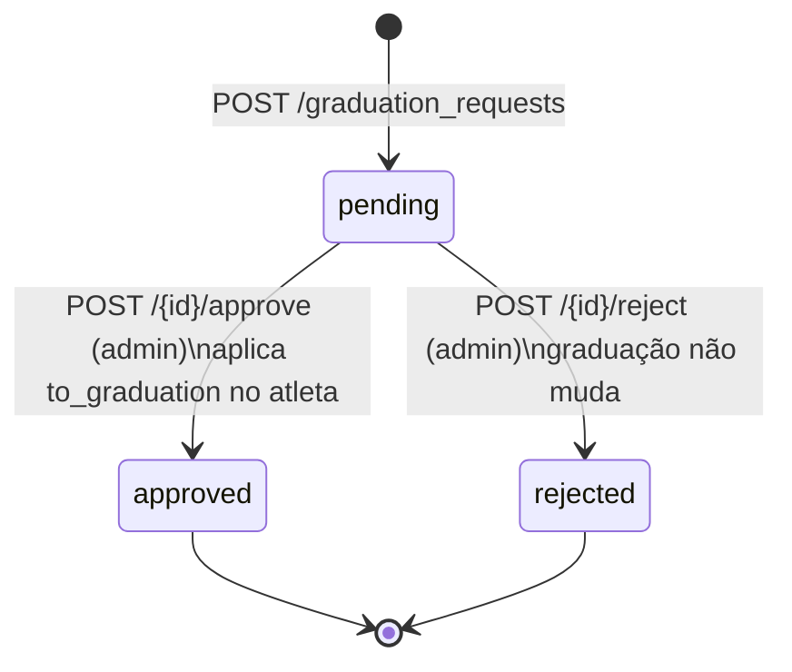

# Spec 004 — Fluxo de graduação

- **Status**: Implementado
- **ADRs relacionados**: [003](../decisions/ADR-003-graduacao-somente-via-fluxo-aprovacao.md), [007](../decisions/ADR-007-graduacoes-strings-canonicas.md)

## Objetivo

Garantir que **toda** mudança de graduação de atleta passe por solicitação e aprovação,
com rastro completo: quem pediu, quem revisou, quando e por quê. Não existe outro caminho
na API para alterar `graduation`.

## Máquina de estados

Estados finais são imutáveis — re-aprovar/re-rejeitar retorna 409.

## Requisitos funcionais

- **RF-001** — Criar solicitação para um atleta com `to_graduation` e `reason` opcional;
  `from_graduation` é snapshot automático da graduação atual.
- **RF-002** — Listar solicitações com filtros `status` e `athlete_id`, ordenadas da mais
  recente, com nomes resolvidos (atleta, solicitante, revisor).
- **RF-003** — Consultar solicitação por id.
- **RF-004** — Aprovar (aplica `to_graduation` no atleta) ou rejeitar, com `review_notes`
  opcional, registrando revisor e `reviewed_at`.

## Regras de negócio

- **RN-001** — Pode **solicitar**: admin, o professor individual do atleta, ou o manager
  da academia (`home_academy`) dele — 403 para os demais (inclusive o próprio atleta).
- **RN-002** — Pode **aprovar/rejeitar**: somente admin (403).
- **RN-003** — No máximo **uma solicitação pendente por atleta** — criar outra retorna 409
  citando o id da existente. (Imposto na aplicação, não por constraint de banco.)
- **RN-004** — `to_graduation` deve ser uma das 20 strings canônicas (422) e diferente da
  graduação atual do atleta (422). Não há restrição de "pular níveis" nem de direção —
  rebaixamento é permitido e passa pelo mesmo fluxo.
- **RN-005** — Visibilidade da listagem para não-admin: apenas solicitações **feitas por
  ele** ou cujo atleta-alvo está sob sua responsabilidade (seus alunos diretos ou alunos
  das academias que gerencia). Admin vê tudo.
- **RN-006** — Aprovação e mudança da graduação do atleta acontecem na mesma transação.

## Critérios de aceite (cenários-chave)

1. Professor cria solicitação para aluno seu → 201, status `pending`, `from_graduation`
   preenchido; para atleta que não é aluno seu → 403.
2. Segunda solicitação para o mesmo atleta com uma pendente → 409.
3. Admin aprova → 200, request `approved`, atleta com a nova graduação, `reviewed_by` e
   `reviewed_at` preenchidos.
4. Admin rejeita com `review_notes` → 200, graduação do atleta inalterada.
5. Aprovar request já aprovada → 409.
6. Teacher lista solicitações → vê apenas as suas/da sua responsabilidade; admin vê todas.
7. `to_graduation` igual à atual → 422.

## Fora de escopo

- Exames/bancas, requisitos de tempo mínimo entre graduações, notificações ao atleta.

## Rastreabilidade

| Elemento | Código | Testes |
|---|---|---|
| Rotas e fluxo | `backend/app/api/graduation_requests.py` | `tests/integration/test_graduation_requests.py` |
| Permissão de solicitar | `Athlete.can_request_graduation_change` (`models/athlete.py`) | idem |
| Modelo/estados | `backend/app/models/graduation_request.py` | idem |
| Telas | `frontend/app/dashboard/graduacoes/`, `components/graduation-request-form.tsx`, `graduation-requests-table.tsx` | — |
